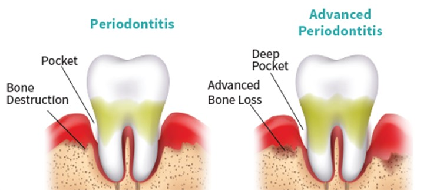
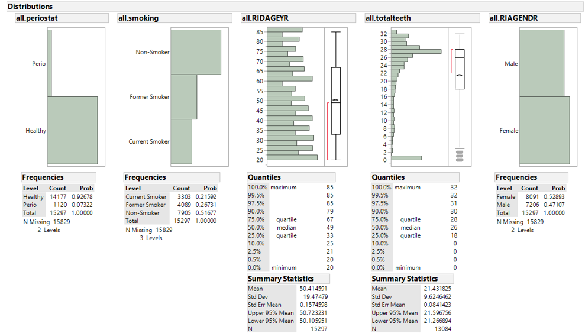
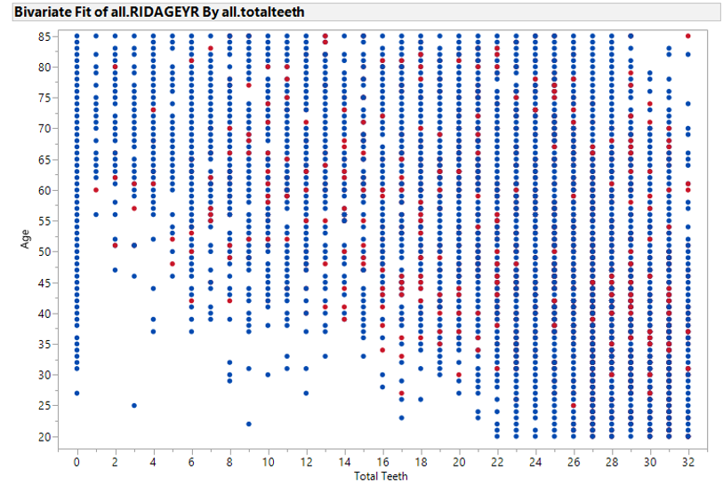
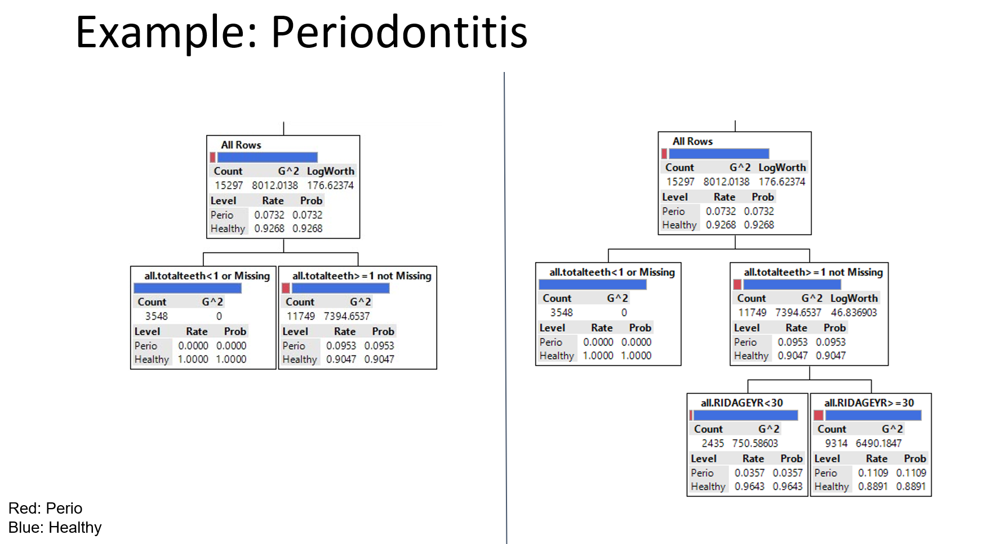

[**Download R Code for this Lecture**](code/introduction-to-CART.R){ .btn .btn-primary }



### Introduction to CART Modeling

## Understanding the Basics of CART and Its Application in Research

Classification and Regression Trees (CART) are powerful tools for predictive modeling, capable of handling both categorical and continuous outcomes.
CART is used extensively in healthcare research and the [basis of more advanced tree methods](https://blog.dataiku.com/tree-based-models-how-they-work-in-plain-english) meant to predict key health outcomes and uncover relationships in complex datasets.

### Define CART Modeling

CART builds a decision tree to predict the outcome variable based on the input variables.
It splits the data into subsets based on the value of input variables, aiming to create the most homogeneous subsets possible.

### Real-World Examples of Decision Trees

-   **Healthcare Diagnosis**: Predicting whether a patient has a disease based on symptoms and test results.
-   **Treatment Recommendations**: Suggesting personalized treatment plans based on patient history and characteristics.

#### Periodontitis



-   Periodontitis is a serious gum infection that damages the soft tissue and destroys the bone that supports your teeth. It can cause teeth to loosen or lead to tooth loss. Periodontitis is common but largely preventable. It's usually the result of poor oral hygiene. Daily brushing and flossing, along with regular dental checkups, can greatly reduce your chance of developing periodontitis.

- The data: National Health and Nutrition Examination Study (NHANES) from 1999-2004. Approximately 15,000 observations. Primary outcome is whether the subject got periodontitis (yes/no). Explanatory or Predictor Variables: Smoking Status, Age, Total Teeth, and Gender.



*A simple cross-section of two variables by the outcome (color: blue=no perio, red=perio), looking for tree splits that classify the outcome accurately. Can you find any splits with age and total teeth?*



*A tree of depth 2 (left) and tree of depth 3 (right).*



### Types of Outcomes: Categorical and Continuous

-   **Categorical Outcomes**: Use classification trees when predicting a categorical outcome, such as whether a disease is present (yes/no). These trees provide the probability of each category as the outcome.
-   **Continuous Outcomes**: Use regression trees when predicting a continuous outcome, such as blood pressure levels. These trees provide the average outcome value for individuals in the dataset who follow the specific path defined by the tree.

### Graphical Representations

Decision trees are represented graphically with nodes and branches: - **Decision Nodes**: Represent decisions or splits based on input variables.
- **Leaf Nodes**: Represent the final outcome or prediction.

### How and When to Split

Splitting in a decision tree is based on criteria such as: - **Gini Impurity**: Used for classification, aiming to create pure subsets.
- **Mean Squared Error (MSE)**: Used for regression, aiming to minimize variance within subsets.

### Pros and Cons of CART Modeling

**Pros**: - Easy to interpret and visualize.
- Can handle both numerical and categorical data.
- No need for data normalization or scaling.

**Cons**: - Can overfit the data, leading to poor generalization.
- Sensitive to small changes in the data.
- May require pruning to remove unnecessary branches.

### Example CART Model

To illustrate a CART model, consider predicting diabetes based on patient characteristics:

1.  **Load Data**: Prepare the dataset containing patient features and diabetes status.
2.  **Define Model**: Specify the CART model parameters.
3.  **Train Model**: Fit the CART model to the data.
4.  **Evaluate Model**: Assess the model's performance using metrics like accuracy and ROC curve.

### Hands-on Exercise: Building a CART Model Based on Students' Own Decisions

You can use the <a href="Titanic_Passengers.csv" download>Titanic_Passengers</a> dataset for this example.
This dataset contains information on the survival status of Titanic passengers.

#### R Code Example

```{r, eval=FALSE}
# Load necessary libraries
library(rpart)
library(rpart.plot)

# Load the dataset
Passengers <- read.csv("Titanic_Passengers.csv") # adjust path

# Define the CART model
model <- rpart(Survived ~ Sex+Age+Passenger.Class+Port,
data = Passengers , method = "class")

# Plot the decision tree
rpart.plot(model)
```
