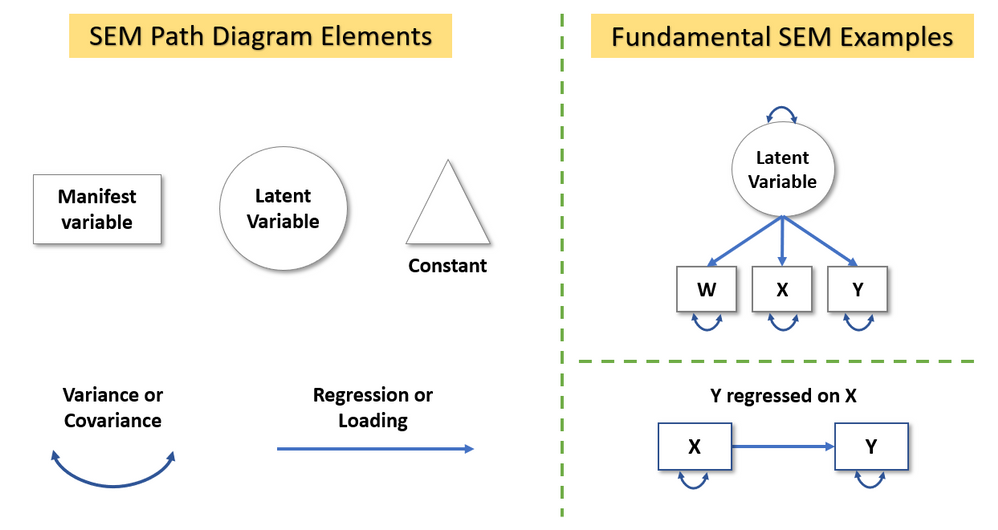

[**Download R Code for this Lecture**](code/introduction-to-CFA-PA.R){ .btn .btn-primary }

### Introduction to Confirmatory Factor Analysis (CFA) and Path Analysis (PA)

## Understanding the Basics of Confirmatory Factor Analysis (CFA) and Path Analysis (PA) and their Application in Nursing Research

Confirmatory Factor Analysis (CFA) and Path Analysis (PA) are essential statistical techniques used to validate measurement models and examine causal relationships between variables, respectively. These methods are crucial in nursing research for understanding complex phenomena and testing theoretical models.

### CFA vs. EFA

-   **Exploratory Factor Analysis (EFA)** is used when you do not have a clear hypothesis about the structure or number of factors.
-   **Confirmatory Factor Analysis (CFA)** is used when you have specific hypotheses or models to test based on theory or prior research.

To conduct a CFA with an anxiety questionnaire in R:

1.  **Data Preparation**: Ensure data is clean and appropriately coded.
2.  **Model Specification**: Define the factor structure based on theoretical expectations.
3.  **Run CFA in R**: See below for an example.

### Interpreting CFA Symbols, Intro to Path Analysis

CFA uses various symbols to represent latent variables, observed variables, and the relationships between them. Path analysis extends this by allowing for more complex models, including direct and indirect effects between observed and latent variables.



### Define Path Analysis, Contrast with CFA and EFA

Path analysis is a type of structural equation modeling (SEM) that examines the direct relationship among a set of observed variables. 

### Define Path Diagram

A path diagram visually represents the hypothesized relationships among variables. It includes: - **Observed Variables**: Represented by rectangles. 

### Special Considerations: No Latent Variables, Correlation vs. Causation

-   **No Latent Variables**: Path analysis can be conducted without latent variables, focusing only on observed variables.
-   **Correlation vs. Causation**: Path analysis can help infer causality, but it is essential to consider the theoretical basis and experimental design to make causal claims.

### Assessing Goodness of Fit (CFI and RMSEA)

-   **Comparative Fit Index (CFI)**: Values close to 1 indicate a good fit.
-   **Root Mean Square Error of Approximation (RMSEA)**: Values less than 0.06 indicate a good fit.

### Example, Hands-on CFA Exercise in R

You can use the <a href="worland5.csv" download>worland5.csv</a> as an example. This hypothetical dataset examines the effects of student background on academic achievement. It contains 9 observed variables (Motivation, Harmony, Stability, Negative Parental Psychology, SES, Verbal IQ, Reading, Arithmetic and Spelling) and 3 hypothesized latent constructs (Adjustment, Risk, Achievement).

#### R Code Example

```{r, eval=FALSE}
# Load necessary library
library(lavaan)
#load your data
mydata3<-read.csv("worland5.csv") # adjust the file path accordingly

# Define the model
model <- 'adjustment  =~ motiv + harm + stabi'

# Fit the model
fit <- cfa(model, data = mydata3)

# Summarize the results
summary(fit, fit.measures = TRUE)
```

### Interpreting Your Results, Refining, Write-up

After running your CFA or path analysis, interpret the results focusing on the goodness of fit indices and the significance of path coefficients. Refining the model may involve adding or removing paths or re-specifying the factor structure based on theoretical considerations and model diagnostics. Document the final model and its implications for nursing research in a clear and structured manner.