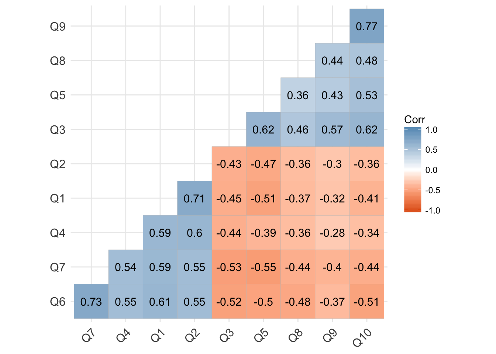
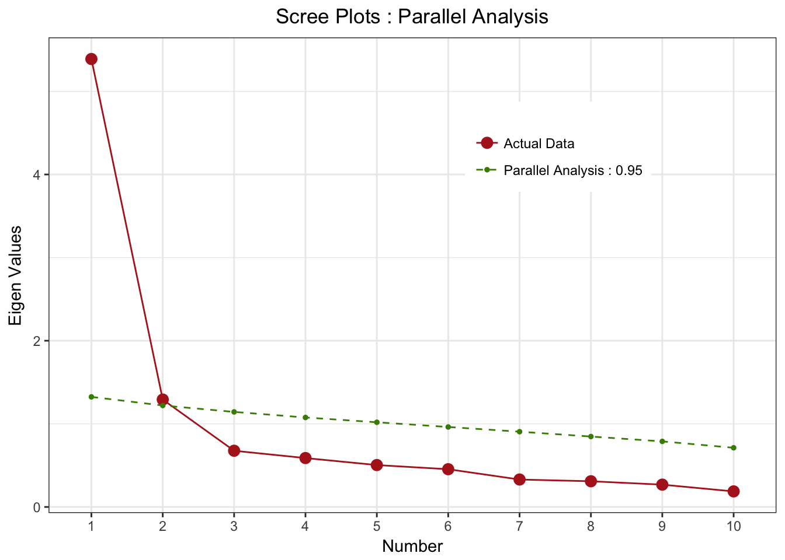
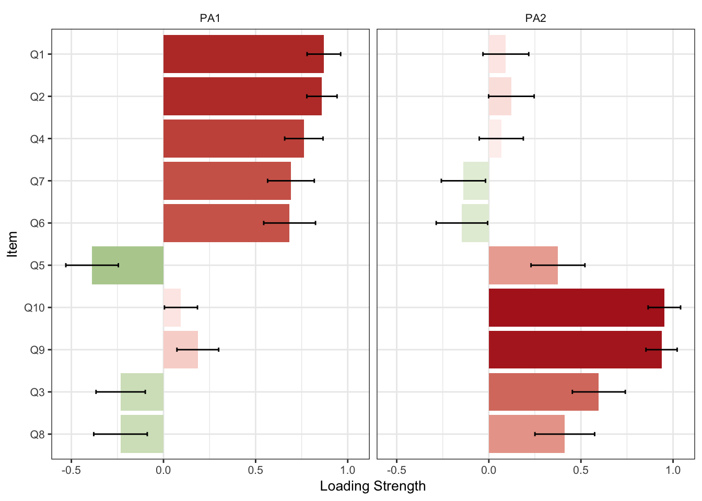

[**Download R Code for this Lecture**](code/introduction-to-EFA.R){ .btn .btn-primary }







[Dr. Habing's EFA notes](530efa.pdf)

# Introduction to Exploratory Factor Analysis (EFA)

Exploratory Factor Analysis (EFA) is a statistical technique used to uncover the underlying structure of a relatively large set of variables. It is often used in research to identify latent variables that cannot be measured directly.

## Understanding the Basics of Latent Variables

-   **Definition**: Latent variables are variables that are not directly observed but are inferred from other variables that are observed (measured).
-   **Examples**:
    -   Intelligence inferred from cognitive test scores.
    -   Depression inferred from responses to psychological questionnaires.
-   **Importance in Research**:
    -   Helps in understanding underlying constructs that are not directly measurable.
    -   Essential in fields like psychology, education, and social sciences where many constructs are abstract.

## Understanding an R Matrix/Correlations



-   **R Matrix**:
    -   A correlation matrix showing the correlation coefficients between pairs of variables.
    -   Each cell in the matrix represents the correlation between two continuous variables.
-   **Interpreting Correlations**:
    -   Correlation values range from -1 to 1.
    -   Correlation is a measure of the strength of the linear relationship between two continuous variables.
    -   Closer to 1 or -1 indicates strong positive or negative correlation, while closer to 0 indicates weak correlation.
-   **Uses in EFA**:
    -   Identifies patterns of correlations.
    -   Variables that are correlated are likely being influenced by the same underlying latent factor.
    -   Helps in determining the suitability of data for factor analysis.
    -   Use the correlation matrix (R Matrix) to check for clusters of variables that are correlated. If there is a lack of clusters then your data may not be suitable for EFA.
    -   Checking the correlation matrix (R Matrix) for a large dataset can be difficult.

## Measurement Theory

-   **Definition**: The study of how to assign numbers to objects and events according to rules.
-   **Components**:
    -   **Constructs**: Theoretical concepts being measured (e.g., intelligence, satisfaction).
    -   **Indicators**: Observed variables that reflect or are influenced by the constructs.
-   **Applications**:
    -   Ensuring that the indicators accurately and reliably measure or are influenced by the constructs.
    -   Validating the measurement instruments.

## Differences Between PCA and EFA

-   **Principal Component Analysis (PCA)**:
    -   Aimed at reducing the dimensionality of the data.
    -   Transforms the variables into a new set of uncorrelated components.
    -   Components are linear combinations of the original variables.
-   **Exploratory Factor Analysis (EFA)**:
    -   Researcher uses EFA because they believe there are latent (unobserved) variables.
    -   Seeks to identify latent factors that explain the correlations among variables.
    -   Factors are assumed to cause the observed variables.
    -   Factors can be assumed to be correlated or or uncorrelated.
-   **Key Differences**:
    -   **Goal**: PCA is descriptive, EFA is explanatory.
    -   **Components vs. Factors**: PCA components are not based on underlying constructs, whereas EFA factors are.

## Pre-Analysis (Correlations, Descriptives, etc.)

-   **Steps**:
    -   **Check for Correlations**: Ensure variables are sufficiently correlated for EFA. Check R Matrix.
    -   **Descriptive Statistics**: Examine means, standard deviations, and distribution shapes. Floor and Ceiling Effects.
    -   **Assumptions**:
        -   Adequate sample size (at least 5-10 times the number of variables).
        -   Normality of variables.
        -   Linearity and homoscedasticity.

## Factoring Methods (Principal Axis, Maximum Likelihood)

-   **Principal Axis Factoring (PAF)**:
    -   Focuses on shared variance.
    -   Suitable for data where normality cannot be assumed.
-   **Maximum Likelihood (ML)**:
    -   Assumes multivariate normality.
    -   Provides goodness-of-fit measures.
    -   Useful for hypothesis testing about the factor structure.
-   **Choosing the Method**:
    -   Depends on the nature of the data and research objectives.
    -   ML is preferred for confirmatory purposes, PAF for exploratory purposes.

## Prior Communality

-   **Definition**: Estimate of the variance in each variable accounted for by the common factors.
-   **Methods of Estimation**:
    -   Squared multiple correlations.
    -   Setting to a default value such as 1.
-   **Role in EFA**:
    -   Helps in the initial extraction of factors.
    -   Influences the factor solution and interpretation.

## Choosing Your Eigenvalue, Rotation Method

-   **Eigenvalue**:
    -   Represents the amount of variance explained by each factor.
    -   Common rule: retain factors with eigenvalues greater than 1.
-   **Rotation Methods**:
    -   **Varimax (Orthogonal)**:
        -   Simplifies the loadings to make interpretation easier.
        -   Assumes factors are uncorrelated.
    -   **Promax (Oblique)**:
        -   Allows for correlated factors.
        -   Provides a more realistic representation of the data.
-   **Purpose of Rotation**:
    -   Enhances interpretability of the factor solution.
    -   Clarifies the structure by maximizing high loadings and minimizing low loadings on each factor.

## Picking the number of factors and understanding loadings

### Picking the Number of Factors

-   **Eigenvalues Greater Than 1**:
    -   Use the Kaiser criterion, which suggests retaining factors with eigenvalues greater than 1.
    -   Factors with eigenvalues above 1 explain more variance than a single observed variable.
-   **Scree Plot**:
    -   Examine the scree plot for an "elbow point," where the slope of eigenvalues levels off.
    -   Retain factors before the point where the plot starts to flatten.
-   **Parallel Analysis**:
    -   Compare the observed eigenvalues to those obtained from random data of the same size.
    -   Retain factors with observed eigenvalues greater than the corresponding random eigenvalues.



-   **Cumulative Variance Explained**:
    -   Consider the total variance explained by the retained factors.
    -   Aim for a solution that explains a substantial proportion of the total variance (e.g., 70-80%).
-   **Theoretical Considerations**:
    -   Consider the theoretical framework and prior research.
    -   Ensure the number of factors makes sense in the context of the study's conceptual model.

### Understanding Loadings



-   **Factor Loadings**:
    -   Represent the correlation between observed variables and the latent factor.
    -   Loadings range from -1 to 1, with higher absolute values indicating stronger relationships.
-   **Significant Loadings**:
    -   Loadings greater than ±0.30 are generally considered significant.
    -   Higher thresholds (e.g., ±0.50 or ±0.60) indicate more robust relationships.
-   **Interpreting Factors**:
    -   Label factors based on the variables with the highest loadings.
    -   Consider the conceptual meaning and relevance of the variables in the context of the study.
-   **Rotation Methods**:
    -   Use rotation methods (e.g., varimax, oblimin) to achieve a simpler, more interpretable structure.
    -   Orthogonal rotations (e.g., varimax) assume factors are uncorrelated, while oblique rotations (e.g., oblimin) allow for correlated factors.
-   **Interpreting Results**:
    -   **Picking the number of factors**: use the scree plot or eigenvalue rule.

    -   **Factor Loadings**: Indicates the strength and direction of the relationship between variables and factors.

    -   **Communalities**: Indicates the proportion of each variable's variance explained by the factors.

    -   **Variance Explained**: The total variance accounted for by all the factors.
-   **Writing Up**:
    -   Describe the data and the preliminary analysis.
    -   Detail the extraction method and rotation used.
    -   Show scree plot and argue why you are choosing the number of factors you are.
    -   Present the factor loadings, communalities, and variance explained via tables and figures.
    -   Discuss the theoretical and practical implications of the factors.

By understanding the basics of EFA, latent variables, and their application in research, researchers can effectively use this technique to uncover underlying structures in their data, providing valuable insights and advancing knowledge in their field.

# Software Examples

Here is how to perform EFA in R: Use the <a href="Williams.sav" download>Williams.sav</a> dataset to complete the analysis. This dataset contains an 28-item questionnaire (measured on a 7-point Likert scale) on organizational ability. It contains 5 theoretical dimensions based on the underlying measurement theory: (1) preference for organization; (2) goal achievement; (3) planning approach; (4) acceptance of delays; and (5) preference for routine.

#### R Code Example

```{r, eval=FALSE}
library(haven)
my_data<-read_sav("Williams.sav")
library(psych)
head(my_data)

efa <- fa(my_data, nfactors = 2, rotate = "varimax")

        # View results
print(efa)

print(loadings(efa ))
```

By understanding the basics of EFA and its application in R, you can effectively analyze latent structures in your data and contribute valuable insights to your research.
